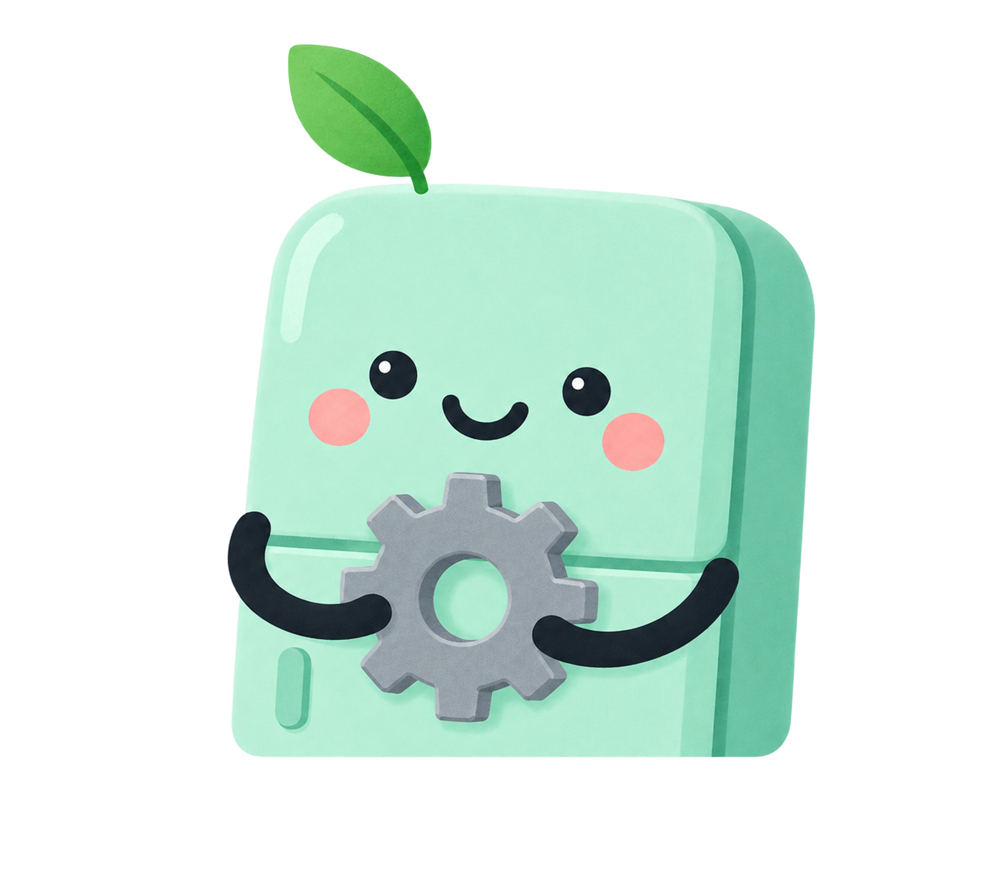

<div align="center">


# 냉장고 구조대 &nbsp;<sub>Fridge Rescue</sub>

**좋은 음식이 좋은 지구를 만들어요! 🌍**

냉장고 속 식품의 유통기한을 관리해 **음식물 쓰레기를 줄이고**,<br/>
유통기한이 임박한 음식을 버리지 않고 먹는 **"구조"** 습관을 돕는 모바일 우선 웹 서비스

<br/>


[주요 기능](#주요-기능) · [화면 구성](#화면-구성) · [마스코트](#마스코트) · [아키텍처](#시스템-아키텍처) · [로컬 실행](#로컬-실행-방법) · [문서](#참조-문서)

</div>

---

- **타깃 사용자**: 자취생, 1인 가구, 식재료 관리에 관심 있는 일반 소비자
- **플랫폼**: 브라우저에서 동작하는 웹앱 (아이폰 14 Pro / 15 뷰포트 393×852 기준 반응형)
- **한 줄 요약**: 등록 → D-day 알림 → "먹었어요/폐기했어요" → 통계로 구조율 확인

## 목차

- [주요 기능](#주요-기능)
- [화면 구성](#화면-구성)
- [마스코트](#마스코트)
- [기술 스택](#기술-스택)
- [시스템 아키텍처](#시스템-아키텍처)
- [프로젝트 구조](#프로젝트-구조)
- [데이터 모델](#데이터-모델)
- [API 개요](#api-개요)
- [로컬 실행 방법](#로컬-실행-방법)
- [환경 변수](#환경-변수)
- [배포](#배포)
- [핵심 정책 요약](#핵심-정책-요약)
- [참조 문서](#참조-문서)

---

## 주요 기능

| 영역 | 설명 |
|---|---|
| **인증** | 이메일/비밀번호 회원가입·로그인·로그아웃. 약관 동의 절차 없음, 소셜 로그인·비밀번호 찾기 미제공. "로그인 상태 유지" 시 토큰 장기 발급 |
| **음식 등록/수정/삭제** | 음식명·카테고리(유제품/채소/과일/육류/기타)·수량·구매일·유통기한·보관위치(냉장/냉동/실온)·메모. 단일 화면에서 즉시 등록 |
| **D-day & 상태 뱃지** | `유통기한 − 오늘` 로 D-day 계산. `D-0/D-1` 위험 · `D-2/D-3` 임박 · `D-N` 정상 · 기한 경과 시 **"유통기한경과"** 뱃지 (자동 폐기 없음) |
| **목록 조회** | 카드형 리스트 + 음식명 검색 + 카테고리/보관위치/상태 필터 + 정렬(유통기한 임박순/최근 등록순/이름순) |
| **상태 처리** | "먹었어요"(구조) / "폐기했어요"(폐기) 처리 시 `resolved_at` 기록 + 통계 즉시 반영 |
| **알림** | 오늘 만료 / 3일 이내 임박 / 이미 지난 음식 목록. **D-1·D-3 토글**(기본 ON)에 따라 매일 **KST 08:00** FCM 푸시 발송 |
| **통계 대시보드** | 기간별(오늘/이번 주/이번 달) 구조 수·폐기 수·구조율·임박 음식 수(전기간 대비 증감), 카테고리별 구조 현황(막대), 상태 비중(도넛), 최근 요약(최대 5건) |
| **보관 꿀팁** | 음식 상세 진입 시마다 10개 문구 풀에서 1개 랜덤 노출 |
| **설정** | 닉네임·비밀번호 변경, 샘플 데이터 추가, 전체 데이터 삭제(확인 모달), 프로젝트 소개, 문의/FAQ |
| **AI 레시피 추천** | UI 버튼만 제공, 실제 추천 로직은 후순위(백로그) — 호출 시 `501 NOT_IMPLEMENTED` |

---

## 화면 구성

13개 화면(모바일 IA). 하단 5탭: **홈 / 음식 등록 / 목록 보기 / 통계 / 설정**.

| 화면 ID | 화면명 | 진입 경로 | 프론트 라우트 |
|---|---|---|---|
| SCR-LOGIN | 로그인 | 앱 최초 실행 / 로그아웃 후 | `/login` |
| SCR-SIGNUP | 회원가입 | 로그인 "회원가입" 링크 | `/signup` |
| SCR-HOME | 홈 | 로그인 성공 후 / 탭바 | `/home` |
| SCR-FOOD-ADD | 음식 등록 | 홈·목록 FAB(+) / 탭바 | `/foods/new` |
| SCR-FOOD-DETAIL | 음식 상세조회 | 홈 카드 / 목록 / 알림 항목 클릭 | `/foods/:foodId` |
| SCR-FOOD-EDIT | 음식 수정 | 상세 "수정" | `/foods/:foodId/edit` |
| SCR-FOOD-LIST | 목록(냉장고 목록) | 탭바 "목록 보기" | `/foods` |
| SCR-STATS | 통계 | 탭바 "통계" | `/stats` |
| SCR-NOTI | 알림 | 홈/목록/통계 상단 종 아이콘 | `/notifications` |
| SCR-SETTINGS | 설정 | 탭바 "설정" | `/settings` |
| SCR-SETTINGS-PROFILE | 계정 설정 | 설정 "닉네임 수정" | `/settings/profile` |
| SCR-SETTINGS-DELETE | 전체 데이터 삭제 | 설정 "전체 데이터 삭제" | (바텀시트 모달) |
| SCR-FAQ | 문의/FAQ | 설정 "문의" | `/settings/faq` |

와이어프레임 원본: [`images/와이어프레임/`](images/와이어프레임/)

---

## 마스코트

냉장고 모양 마스코트가 화면 맥락에 맞는 소품과 함께 등장해, 말풍선으로 짧은 응원·안내 문구를 건넵니다.

<table>
  <tr>
    <td align="center" width="140"></td>
    <td align="center" width="140"></td>
    <td align="center" width="140"></td>
    <td align="center" width="140"></td>
  </tr>
  <tr>
    <td align="center"><sub><b>홈 · 로그인</b><br/>🫶 하트</sub></td>
    <td align="center"><sub><b>회원가입</b><br/>📋 클립보드</sub></td>
    <td align="center"><sub><b>음식 상세 · 레시피</b><br/>🥣 숟가락·수프</sub></td>
    <td align="center"><sub><b>알림</b><br/>🔔 알림 종</sub></td>
  </tr>
  <tr>
    <td align="center"></td>
    <td align="center"></td>
    <td align="center"></td>
    <td align="center"></td>
  </tr>
  <tr>
    <td align="center"><sub><b>통계</b><br/>📊 막대그래프·엄지척</sub></td>
    <td align="center"><sub><b>목록 · 문의</b><br/>🔍 돋보기·장바구니</sub></td>
    <td align="center"><sub><b>설정 · 계정</b><br/>⚙️ 톱니바퀴</sub></td>
    <td align="center"></td>
  </tr>
</table>

> 마스코트 에셋: [`images/character/`](images/character/) · 프론트엔드에서는 [`frontend/src/assets/character/`](frontend/src/assets/character/) 로 로드합니다.

---

## 기술 스택

| 구분 | 스택 |
|---|---|
| **Frontend** | React 19, Vite 8, React Router 7, 순수 CSS(디자인 토큰 `src/styles/tokens.css`), Oxlint |
| **Backend** | Django 6, Django REST Framework 3.18, SimpleJWT(단일 Bearer 토큰), Celery 5.6 + django-celery-beat |
| **Database** | MySQL 8.0+ (InnoDB, `utf8mb4`), PyMySQL 드라이버 |
| **비동기/캐시** | Redis (Celery 브로커 & 결과 백엔드) |
| **푸시** | Firebase Admin SDK (FCM) — 서비스 계정 키 없으면 로그만 남기고 skip |
| **배포(예시)** | Frontend: Netlify · Backend: Render(gunicorn) |

> 스택은 `docs/CLAUDE.md`에 고정되어 있습니다. React / Django / MySQL 범위 밖의 프레임워크·DB(예: Next.js, FastAPI, PostgreSQL)는 도입하지 않습니다.

---

## 시스템 아키텍처

```
┌─────────────────┐        HTTPS + JSON         ┌──────────────────────────┐
│  React SPA       │  ──  REST /v1/*  ────────▶  │  Django + DRF            │
│  (Vite, Netlify) │  ◀── { success, data } ──   │  (gunicorn, Render)      │
└─────────────────┘   Authorization: Bearer      └────────────┬─────────────┘
                                                              │ ORM (PyMySQL)
                                                 ┌────────────▼─────────────┐
                                                 │  MySQL 8  (7 tables)     │
                                                 └────────────┬─────────────┘
                                                              │
   ┌────────────────┐   broker/result   ┌────────────┐        │ 집계·조회
   │ Celery Worker  │ ◀───────────────▶ │  Redis     │        │
   │ Celery Beat    │                   └────────────┘        │
   └───────┬────────┘                                         │
           │ 매일 KST 08:00  send_daily_expiry_push           │
           ▼                                                  │
   ┌────────────────┐   D-1 / D-3 조건 식품 조회 ──────────────┘
   │ Firebase (FCM) │   → 사용자 기기 토큰으로 푸시 발송
   └────────────────┘
```

- 프론트엔드와 백엔드는 `docs/API명세서.md`의 REST 계약으로만 통신합니다.
- `d_day`, `badge` 는 저장하지 않고 조회 시점에 계산되는 파생 값입니다.
- 구조/폐기 이력은 `food_activity_logs`에 **스냅샷(append-only)**으로 남아, "전체 데이터 삭제" 후에도 과거 통계가 유지됩니다.

---

## 프로젝트 구조

```
fridge-rescue/
├── backend/                     # Django 프로젝트
│   ├── config/                  # settings, urls, celery, 인증, 예외, ID 채번, Firebase 래퍼
│   ├── accounts/                # 회원가입/로그인/로그아웃, /users/me, RefreshToken
│   ├── foods/                   # 식품 CRUD, 상태 변경, 샘플 데이터, 레시피 추천(placeholder)
│   ├── notifications/           # 알림 목록, 알림 설정, 기기 토큰, Celery task(tasks.py)
│   ├── stats/                   # 기간별 통계 집계 + FoodActivityLog 모델
│   ├── content/                 # 보관 꿀팁 랜덤, FAQ (시드 데이터 마이그레이션 포함)
│   ├── manage.py
│   └── requirements.txt
├── frontend/                    # React + Vite
│   ├── src/
│   │   ├── api/                 # client.js(공통 fetch 래퍼) + 도메인별 호출 모듈
│   │   ├── components/          # Button, Badge, PillGroup, Stepper, DonutChart, ConfirmModal, layout/*
│   │   ├── context/             # AuthContext, ToastContext
│   │   ├── pages/               # 화면별 컴포넌트 (13종)
│   │   ├── config/              # constants.js, copy.js, chartColors.js (카피·색상·상수 분리)
│   │   ├── assets/character/    # 마스코트 이미지 7종
│   │   └── styles/              # tokens.css, forms.css
│   ├── public/_redirects        # Netlify SPA 라우팅 폴백
│   └── vite.config.js           # dev 서버 :5173, /v1 → :8000 프록시
├── docs/                        # 기능명세서 / API명세서 / DB설계서 / 시스템 아키텍처 / CLAUDE.md
└── images/                      # 와이어프레임 원본 + 마스코트/아이콘 에셋
```

---

## 데이터 모델

MySQL 7개 테이블 (상세: [`docs/DB설계서.md`](docs/DB설계서.md)).

| 테이블 | 역할 | 비고 |
|---|---|---|
| `users` | 계정 (이메일 UNIQUE, 비밀번호 해시) | PK `usr_...` (VARCHAR 30) |
| `foods` | 식품 재고 | PK `food_...`, `category`/`storage_location`/`status` ENUM, `(user, status, expiry_date)` 인덱스, `name` FULLTEXT |
| `food_activity_logs` | 구조/폐기 이력 (append-only) | `food_id` 는 원본 삭제 시 `SET NULL`, `food_name`·`category` 스냅샷 보존 |
| `notification_settings` | 사용자당 1행 (1:1) | `d1_enabled`/`d3_enabled` 토글, `notify_time` 08:00 · `timezone` Asia/Seoul 고정 |
| `refresh_tokens` | 발급 토큰 해시 저장 | 로그아웃 시 `revoked_at` 기록 → 매 요청 폐기 여부 검사 |
| `storage_tips` | 보관 꿀팁 10종 (전역) | 마이그레이션으로 시드 |
| `faqs` | FAQ 12문항 (전역) | 미작성 답변은 `answer = NULL` |
| `device_tokens` | FCM 기기 토큰 | 명세서 외, 푸시 실동작을 위해 추가 |

**파생 값**

```
d_day  = expiry_date − 오늘
badge  = d_day < 0 ? "유통기한경과" : "D-" + d_day
```

---

## API 개요

- **Base URL**: 로컬 `http://127.0.0.1:8000/v1` · 배포(예시) `https://api.fridge-rescue.app/v1`
- **인증**: `Authorization: Bearer {token}` (로그인/회원가입 응답으로 발급)
- **공통 응답**: 성공 `{ "success": true, "data": {...} }` / 실패 `{ "success": false, "error": { "code", "message" } }`

| 그룹 | 엔드포인트 |
|---|---|
| 인증 | `POST /auth/signup/` · `POST /auth/login/` · `POST /auth/logout/` |
| 계정 | `GET /users/me/` · `PATCH /users/me/` |
| 식품 | `POST /foods` · `GET /foods` · `DELETE /foods` (전체) · `GET·PATCH·DELETE /foods/{id}` · `PATCH /foods/{id}/status` · `POST /foods/sample` |
| 알림 | `GET /notifications` · `GET·PATCH /notification-settings` · `POST·DELETE /devices/fcm-token` |
| 통계 | `GET /stats?period=today\|week\|month` |
| 콘텐츠 | `GET /storage-tips/random` · `GET /faqs` (인증 불필요) |
| 레시피 | `POST /recipes/recommend` → `501 NOT_IMPLEMENTED` (후순위) |

전체 요청/응답 스펙과 에러 코드는 [`docs/API명세서.md`](docs/API명세서.md) 참조.

---

## 로컬 실행 방법

### 사전 요구 사항

- **Python 3.12+** (Django 6 요구 사항)
- **Node.js 20+** (Vite 8 요구 사항)
- **MySQL 8.0+** — 실행 중이어야 하며 접속 계정 필요
- **Redis** — 알림(Celery worker/beat)을 함께 돌릴 때만 필요. 웹 서버만 띄운다면 없어도 됨

### 1) 데이터베이스 준비

```sql
CREATE DATABASE fridge_rescue CHARACTER SET utf8mb4 COLLATE utf8mb4_unicode_ci;
```

### 2) 백엔드 (Django)

```bash
cd backend
python -m venv .venv
# Windows: .venv\Scripts\activate   /   macOS·Linux: source .venv/bin/activate
pip install -r requirements.txt

# backend/.env 생성 (아래 "환경 변수" 표 참고)

python manage.py migrate
python manage.py runserver 127.0.0.1:8000
```

시드 데이터(보관 꿀팁 10개, FAQ 12문항)는 `content` 앱 마이그레이션으로 자동 적재됩니다.

### 3) 프론트엔드 (React + Vite)

```bash
cd frontend
npm install

# 백엔드로 직접 호출 (settings의 CORS_ALLOWED_ORIGINS에 :5173 허용됨)
VITE_API_URL=http://127.0.0.1:8000 npm run dev
# 또는 vite.config.js의 /v1 프록시 사용: VITE_API_URL=http://localhost:5173 npm run dev
```

→ 브라우저에서 `http://localhost:5173`

### 4) (선택) 알림 워커 — Redis 필요

```bash
cd backend            # .venv 활성화 상태
celery -A config worker --pool=solo --loglevel=info      # Windows는 --pool=solo
celery -A config beat  --loglevel=info --scheduler django_celery_beat.schedulers:DatabaseScheduler
```

`send_daily_expiry_push` 태스크가 매일 KST 08:00에 D-1·D-3 조건 식품을 찾아 FCM 푸시를 발송합니다. `FIREBASE_CREDENTIALS_PATH` 가 비어 있으면 실제 발송 없이 로그만 남깁니다.

---

## 환경 변수

### `backend/.env`

| 키 | 예시값 | 설명 |
|---|---|---|
| `SECRET_KEY` | `local-dev-secret-key` | Django 시크릿 키 |
| `DEBUG` | `True` | 디버그 모드 |
| `ALLOWED_HOSTS` | `localhost,127.0.0.1` | 쉼표 구분 |
| `DB_NAME` | `fridge_rescue` | MySQL 데이터베이스명 |
| `DB_USER` | `root` | MySQL 계정 |
| `DB_PASSWORD` | `********` | MySQL 비밀번호 |
| `DB_HOST` | `127.0.0.1` | MySQL 호스트 |
| `DB_PORT` | `3306` | MySQL 포트 |
| `CORS_ALLOWED_ORIGINS` | `http://localhost:5173` | 프론트 오리진(쉼표 구분) |
| `REDIS_URL` | `redis://127.0.0.1:6379/0` | Celery 브로커/결과 백엔드 |
| `FIREBASE_CREDENTIALS_PATH` | *(비움)* | FCM 서비스 계정 JSON 경로. 비우면 푸시 skip |

### `frontend/.env`

| 키 | 예시값 | 설명 |
|---|---|---|
| `VITE_API_URL` | `http://127.0.0.1:8000` | API 서버 오리진. 여기에 `/v1` 이 붙어 요청됨 |

---

## 배포

- **프론트엔드**: `npm run build` → `frontend/dist` 정적 호스팅(Netlify). SPA 새로고침 라우팅은 `frontend/public/_redirects` (`/*  /index.html  200`)로 처리.
- **백엔드**: gunicorn으로 `config.wsgi` 서빙(Render). `DEBUG=False`, 실제 `SECRET_KEY`·DB·`ALLOWED_HOSTS`·`CORS_ALLOWED_ORIGINS`·`REDIS_URL`·`FIREBASE_CREDENTIALS_PATH` 를 환경 변수로 주입.
- **알림 워커**: Celery worker + beat 프로세스를 별도 워커 다이노/서비스로 상시 구동.

---

## 핵심 정책 요약

`docs/기능명세서_최종본.md` 4장에서 확정된 주요 결정 사항:

- 간편(소셜) 로그인·비밀번호 찾기 미제공. 회원가입은 약관 동의 없이 4개 필드 검증만으로 완료
- 음식 등록은 단계 구분 없이 **단일 화면에서 즉시 등록**
- AI 레시피 추천은 UI만 제공, 클릭 시 "준비 중인 기능이에요" 안내 (실연동 후순위)
- 보관 꿀팁은 카테고리 무관 10개 풀에서 **조회 시마다 랜덤 1개**
- 알림 발송 시각은 **KST 매일 오전 8시 고정** (사용자 커스텀 미지원)
- 유통기한 경과 시 자동 폐기 없이 **"유통기한경과" 뱃지만** 부여
- 전체 데이터 삭제는 **음식(Food) 데이터만** 대상, 삭제 전 확인 모달 필수 (계정·통계 이력 유지)

---

## 참조 문서

| 문서 | 내용 |
|---|---|
| [`docs/기능명세서_최종본.md`](docs/기능명세서_최종본.md) | 기능 요구사항의 단일 진실 공급원 (화면별 상세 명세, 정책 결정, 유저 플로우) |
| [`docs/API명세서.md`](docs/API명세서.md) | REST API 계약 — 엔드포인트, 요청/응답, 에러 코드, 화면↔API 매핑 |
| [`docs/DB설계서.md`](docs/DB설계서.md) | MySQL 스키마 — 테이블 DDL, 인덱스, 시드 데이터, 삭제 정책 |
| [`docs/시스템.png`](docs/시스템.png) | 시스템 구성도 v1.0 |
| [`docs/CLAUDE.md`](docs/CLAUDE.md) | 구현 시 준수 지침 (스택 고정, 와이어프레임 원본 유지, 편집 가능성 요구사항) |

<div align="center">
<br/>

<br/>
<sub><b>냉장고 속 작은 변화가 더 나은 지구를 만듭니다 🌱</b></sub>
</div>
